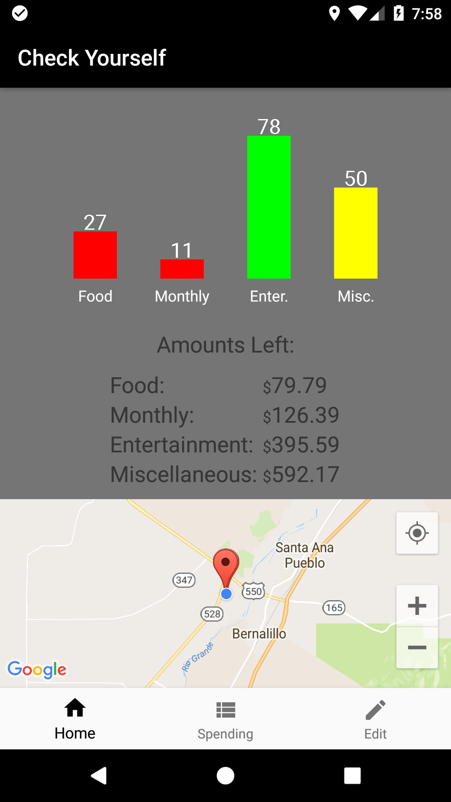
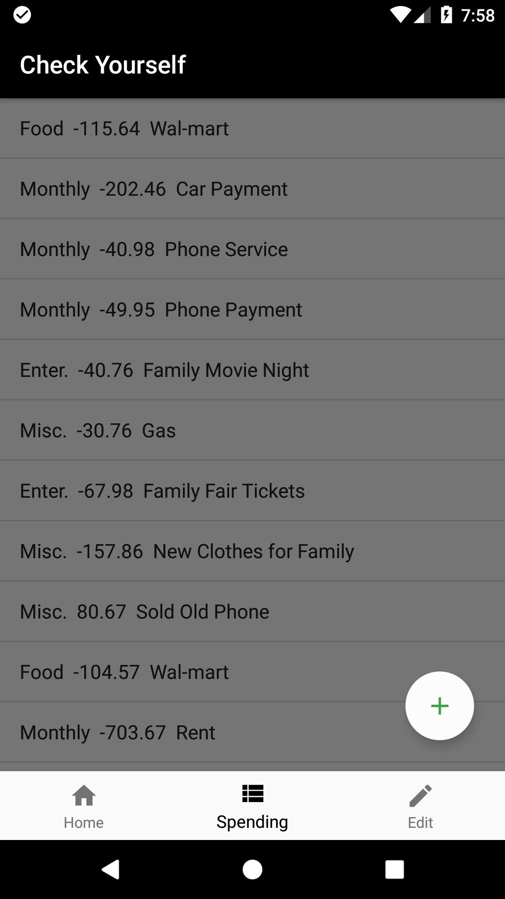
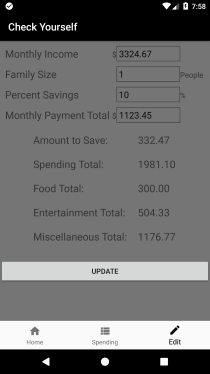

# Check Yourself - A Budget App
A simple budgeting application for Android built in roughly 4-5 weeks that relies entirely on
user input to track spending. Auto-generates a suggested spending amount for
categories of that budget, as well as allowing the user to specify the percentage
of monthly income they'd like to put into savings. The app also sends notifications based
on user's location to remind them of the amount left in their budgets when approaching
certain types of Google Maps POI's. 

  

## Why I Made This
I decided to make a budget app as I'm horrible with managing my own money
and I'm there's others out there that struggle with money management as well. I wanted
to create something that was practical to build for my skill level, as well as a potentially useful
tool for users.

## State of the App
Check Yourself as is could be considered a working prototype as is, it has the
bare bone base of all functionality I intended at the start of building it. That 
being said there is still a lot of work to be done on it such as (in order of
importance):
- Setting up a monthly reset either automatically or via button
- Adding storage of previous months data and perhaps displaying it in a graph or
complex list view
- Polishing the UI to be more "user friendly"
- Stopping the locational notification from spamming the user in clustered POI
points such as a mall
- The screen always updating upon data entry rather than just sometimes
- Improving the locational elements to be more battery efficient

#### Tested Android OS's: 
- Android 7.1.1 (Nexus 5X API 25)
- Android 5.1 (Pixel XL API 22)

#### Restrictions:
- Orientation locked to vertical
- Only in English (for now)

### 3rd Party Libraries
- [GraphView](https://github.com/appsthatmatter/GraphView)--[License](Licenses/GraphViewLicense)
- [Stetho](https://github.com/facebook/stetho)--[License](Licenses/StethoLicense)
- [Android Volley](https://github.com/mcxiaoke/android-volley)-[License](Licenses/VolleyLicense)

### External Services
- [Google Maps API](https://developers.google.com/maps/)--[License](Licenses/GoogleLicense)
- [Google Places API](https://developers.google.com/places/)--[License](Licenses/GoogleLicense)

### UI Improvements to be Made
- Add both a light and dark theme
- Make the text in the ListView formatted 
- Adjust the layout to appear less "clunky"

### Stretch Goals
- Implement the ability to read of the users bank account transactions
to auto-fill the "spending" list
- Make the category/tag system dynamic(i.e. Allow users to add or delete tags)
- Improve the location notification to send specific categories based on location
rather than just sending all categories

#### ---Javadoc Link Placeholder---

## License
Copyright &copy; 2018 Jake Batchelor

Licensed under the Apache License, Version 2.0 (the "License");
you may not use this file except in compliance with the License.
You may obtain a copy of the License at

       http://www.apache.org/licenses/LICENSE-2.0

Unless required by applicable law or agreed to in writing, software
distributed under the License is distributed on an "AS IS" BASIS,
WITHOUT WARRANTIES OR CONDITIONS OF ANY KIND, either express or implied.
See the License for the specific language governing permissions and
limitations under the License.